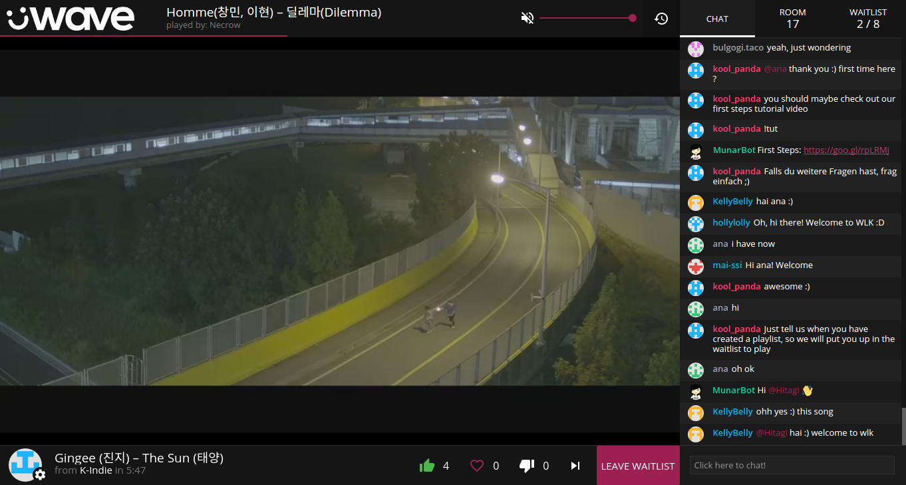

# u-wave-web

Web client for [üWave][].

[Dependencies](#dependencies) - [Setup](#getting-things-working) -
[Building](#building) - [Server API](#server-api) - [Client API](#client-api) -
[License](#license)



## Dependencies

For running in the browser: something modern. The aim is to support ~IE10+ and
other modern browsers (recent Chromes and Firefoxes, at least). If you use
something reasonably recent and üWave doesn't work, [file a bug][]!

The server parts of üWave require Node version >= 8.9.

## Getting Things Working

To run the web client, you need an [HTTP API][u-wave-http-api]. For development,
follow the HTTP API development server guide. Then,

```bash
# Make u-wave-http-api globally available
cd /path/to/u-wave-http-api
npm link
cd ../

git clone https://github.com/u-wave/web u-wave-web
cd u-wave-web
npm install
npm link u-wave-http-api
npm start
```

…and now you should be good to go! `npm start` will automatically start the
HTTP API development server.

If you are running the development server yourself, you can do:

```bash
npm start -- --no-api
```

Then it won't start a new HTTP API development server, and instead assumes
one is already running on `localhost:6042`.

## Building

There are two main build scripts: one for development, and one for production.

The development script runs a local üWave server and auto-reloads the web client
when you make changes.

```bash
npm start # or `npm run dev`
```

When building the üWave web client for use on a server, the production build
should be used instead. It removes costly debugging helpers from the code and
minifies everything as much as possible.

```bash
npm run prod
```

The `prod` script doesn't run a local server. To try out your production build,
you can use the standalone `serve` script:

```bash
npm run serve
```

## Server API

```js
import createWebClient from 'u-wave-web/middleware';
```

### createWebClient(uw, options={})

Create a Web client middleware for use with express-style server libraries.

**Parameters**

 * `uw` - a [üWave Core][u-wave-core] object.
 * `options` - Client options. See the [Client API](#client-parameters) section.

**Example**

This is a small example üWave server on top of Express, using ReCaptcha and
[EmojiOne][] emoji from [u-wave-web-emojione][].

```js
import express from 'express';
import uwave from 'u-wave-core';
import createHttpApi from 'u-wave-http-api';
import createWebClient from 'u-wave-web/middleware';
import emojione from 'u-wave-web-emojione';

const app = express();
const uw = uwave({ /* Options. See the u-wave-core documentation. */ });

app.listen(80);

app.use('/api', createHttpApi(uw, {
  /* Options. See the u-wave-http-api documentation. */
}));

app.use('/assets/emoji', emojione.middleware());
app.use('/', createWebClient(uw, {
  apiBase: '/api',
  emoji: emojione.emoji,
  recaptcha: { key: 'my ReCaptcha site key' },
}));
```

## Client API

```js
import Uwave from 'u-wave-web'
```

### const uw = new Uwave(options={})

Create a new üWave web client.

<a id="client-parameters"></a>
**Parameters**

 * `options`
   * `options.apiBase` - Base URL to the mount point of the
     [üWave Web API][u-wave-http-api] to talk to.
     Defaults to `/api`, but it's recommended to set this explicitly.
   * `options.emoji` - An object describing the emoji that will be available in
     the chat. Keys are emoji shortcodes (without `:`), and values are image
     filenames.
   * `options.recaptcha` - An object containing ReCaptcha options used to ensure
     new user registrations are human. This option should only be passed if the
     [Web API][u-wave-http-api] middleware is configured to check for ReCaptcha
     entries.

     * `options.recaptcha.key` - ReCaptcha site key. This can be obtained from
       the "Keys" panel in the [ReCaptcha site admin page][recaptcha].

   * `options.title` - Document title, what's shown in the tab by the browser.
     Default "üWave".

### uw.source(sourceType, sourcePlugin, options={})

Add a media source. Media sources should also be registered with the
[üWave Core module][u-wave-core] on the server side.

**Parameters**

 * `sourceType` - String representing the source type. Must be the same as the
   one used on the server side.
 * `sourcePlugin` - Factory function for the plugin. This factory function will
   receive two arguments: the `Uwave` class instance, and the options object
   passed to `.source()`.
 * `options` - Options to be passed to the source plugin.

**Example**

```js
import youTubeSource from 'u-wave-web-youtube';

uw.source('youtube', youTubeSource);
```

### uw.renderToDOM(target)

Start the web client and render it into a DOM element.

**Parameters**

 * `target` - A DOM element.

**Example**

```js
uw.renderToDOM(document.getElementById('app'));
```

## License

The üWave web client is licensed under the [MIT][] license.

The default [mention sound file][] comes from a [Sonics.io][] pack and is under
the [Sonics.io License][] (archive link).

[üWave]: https://u-wave.github.io
[u-wave-core]: https://github.com/u-wave/core
[u-wave-http-api]: https://github.com/u-wave/http-api
[u-wave-web-emojione]: https://github.com/u-wave/u-wave-web-emojione

[file a bug]: https://github.com/u-wave/web/issues

[recaptcha]: https://www.google.com/recaptcha/admin#list
[EmojiOne]: https://github.com/Ranks/emojione
[MIT]: ./LICENSE
[mention sound file]: ./assets/audio/mention.opus
[Sonics.io]: http://sonics.io
[Sonics.io License]: https://web.archive.org/web/20150912030216/http://www.sonics.io/license/
